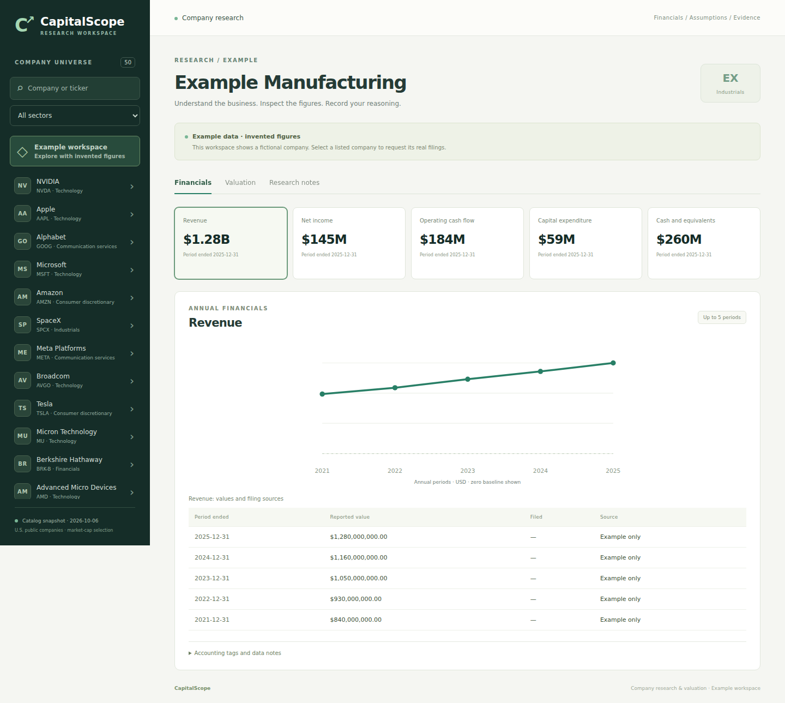

# CapitalScope

I'm building a workspace for company research, valuation, and practice portfolios. I can browse companies, inspect annual figures, save valuation scenarios, and keep research notes. SEC imports and valuation versions now live in a database.

I gave this workspace a midnight-blue and violet design, with top navigation and a searchable company picker. I can read the annual chart beside its source table on desktop; the layout stacks on smaller screens.



## Run the app

With Docker installed, copy `.env.example` to `.env` and set `DATABASE_PASSWORD` to a password for the local database:

```bash
docker compose up --build
```

Open http://localhost:8080. The app starts in a clearly labeled example workspace with invented figures. The company catalog and calculator work without API keys.

For real SEC imports, copy `.env.example` to `.env`, set `SEC_USER_AGENT` to an app name and a real contact email, and restart. I don't include contact information or credentials in the repository. Upstream failures are reported rather than replaced with example numbers.

## What I can do

- Inspect daily price history with source, retrieval date, and raw-price caveats.
- Compare two to four saved valuation cases, inspect changed assumptions, and download their comparison as CSV.
- Inspect cash, company, and sector weights, largest exposures, and the combined top three holdings.
- Keep a saved company watchlist with theses, risks, research status, and review dates.
- Value current holdings using stored daily closes, with dated price evidence, partial coverage, and unrealized P&L.
- Record simulated splits and cash dividends in the same ordered history as trades.
- Create practice portfolios, record manual simulated buys/sells and fees, and inspect cash, holdings, and realized P&L.
- Download financial facts and ordered portfolio events as CSV files.
- Search 50 companies by name or ticker and filter by sector.
- Request annual revenue, net income, operating cash flow, capex, and cash balances from SEC EDGAR.
- Inspect charts, exact values, filing dates, source links, and accounting tags.
- Inspect a 5 × 5 sensitivity table across discount rates and terminal growth assumptions.
- Enter assumptions in a DCF model and inspect projections, estimated value, and terminal contribution.
- Compare two to four companies with matching-period margins, revenue growth, cash after capex, and filing evidence.
- Explore a separate fictional peer set without configuring SEC access.
- Save, reload, and delete named valuation scenarios for each company.
- Save research notes separately for each company in the current browser.

I selected the top 50 American companies from the CompaniesMarketCap ranking observed on October 6, 2026, using one ticker per company. This is a fixed snapshot, not a live ranking. [Company universe](docs/company-universe.md).

Catalog source: https://companiesmarketcap.com/usa/largest-companies-in-the-usa-by-market-cap/

I haven't verified live data coverage for all 50 companies. Recently listed companies may have no annual 10-K facts, and some issuers use unsupported tags. Missing data stays missing.

## Development setup

I use Java 17, Maven 3.9+, and Node.js 22.

Terminal 1:

```bash
export SEC_USER_AGENT='CapitalScope your-real-contact-address'
cd backend
mvn spring-boot:run
```

Terminal 2:

```bash
cd frontend
npm ci
npm run dev
```

Open the Vite URL printed in the terminal. Vite proxies `/api` to port 8080. Set `CAPITALSCOPE_API_TARGET` in a frontend `.env` file to use another backend.

To build one runnable jar containing both the dashboard and backend:

```bash
bash scripts/build.sh
java -jar backend/target/capitalscope-0.1.0.jar
```

## API

| Endpoint | Purpose |
| --- | --- |
| `GET /api/companies/{ticker}/prices` | Cached daily raw prices from Alpha Vantage |
| `GET /api/examples/prices` | Invented price series for the fictional company |
| `GET /api/watchlist` | Shared saved research shortlist |
| `PUT /api/watchlist/{ticker}` | Save thesis, risks, status, optional review date, and expected version and entry ID |
| `DELETE /api/watchlist/{ticker}?version=…&entryId=…` | Remove the active entry using its saved version; retain revision history |
| `GET /api/watchlist/{ticker}/history?before=…` | Read 20 saved revisions at a time with an optional cursor |
| `GET /api/portfolios/{id}/stress-scenarios/{scenarioId}/export.csv` | I download the saved assumptions, results, and price evidence without recalculating |
| `GET /api/portfolios/{id}/stress-scenarios` | I review saved stress snapshots for this portfolio |
| `POST /api/portfolios/{id}/stress-scenarios` | I save `{name, assumptions}` after calculating the current server baseline |
| `DELETE /api/portfolios/{id}/stress-scenarios/{scenarioId}` | I delete one saved stress snapshot |
| `POST /api/portfolios/{id}/stress` | I apply `{defaultShock, sectorShocks}` as decimal price changes to server-held positions; cash stays fixed |
| `GET /api/portfolios/{id}/valuation` | Current holdings at stored closes; partial coverage with missing totals |
| `GET /api/portfolios/{id}/export.csv` | Ordered simulated events, starting cash, exact decimal inputs |
| `GET /api/companies/{ticker}/financials/export.csv` | Annual facts with units, tags, dates, and sources |
| `GET /api/examples/financials/export.csv` | Clearly marked fictional facts |
| `GET /api/portfolios` | Shared practice portfolios |
| `POST /api/portfolios` | Create `{name, mode, initialCash}` |
| `GET /api/portfolios/{id}` | Cash, holdings, and recorded fills |
| `POST /api/portfolios/{id}/actions` | Record a simulated split or dividend with a request UUID |
| `POST /api/portfolios/{id}/trades` | Record `{requestId, ticker, side, quantity, price, fee}` |
| `GET /api/companies` | Company catalog |
| `GET /api/universe` | Snapshot date and selection metadata |
| `GET /api/companies/{ticker}/financials` | Sourced annual SEC facts |
| `GET /api/examples/comparisons` | Three fictional peer reports for exploring comparisons |
| `GET /api/examples/financials` | Explicitly labeled invented example |
| `POST /api/valuations/dcf/sensitivity` | Same assumptions; 25 model evaluations with invalid cells marked |
| `POST /api/valuations/dcf` | Generic FCFF calculator |
| `GET /api/companies/{ticker}/scenarios/price-context` | I compare saved models with a local dated close; gaps require `shareBasisConfirmed=true` |
| `GET /api/companies/{ticker}/scenarios` | Saved versions for a company (`DEMO` is separate) |
| `POST /api/companies/{ticker}/scenarios` | Save `{name, assumptions}`; results calculated on the server |
| `DELETE /api/companies/{ticker}/scenarios/{id}` | Delete one saved version |

Example valuation request:

```bash
curl -X POST http://localhost:8080/api/valuations/dcf \
  -H 'Content-Type: application/json' \
  -d '{"baseFreeCashFlow":100000000,"growthRate":0.05,"discountRate":0.10,"terminalGrowthRate":0.02,"years":5,"netDebt":200000000,"sharesOutstanding":50000000}'
```

These inputs are invented. API rates use decimals (`0.10` means 10%); the interface accepts percentages (`10` means 10%). Money and shares use full units, not millions.

## Model assumptions

I discount **unlevered free cash flow to the firm** using WACC, subtract net debt, and divide equity value by shares outstanding. Negative net debt represents net cash. Reported operating cash flow minus capex isn't automatically unlevered cash flow; model inputs stay separate from the financial report.

This version uses positive starting cash flow, constant growth, and a Gordon-growth terminal value. It doesn't adjust for changing share counts, excess assets, every non-debt claim, or loss-making businesses. Negative equity estimates remain negative. Results disappear when inputs change.

The interface disables the general model for banks, broker-dealers, Berkshire Hathaway, and UnitedHealth in the catalog. These businesses need specialized methods. The generic API itself is not tied to a company ticker.

## Data and storage

Successful SEC responses are stored in the database and reused for six hours, including after a restart. Expired entries are refreshed; an upstream failure does not silently serve stale figures. Outbound requests are spaced at least one second apart. Reports show both retrieval and response timestamps. Shared rate limiting is needed before running multiple backend instances.

I select annual USD facts from supported standard US-GAAP tags, prefer the first supported tag, fill missing periods from alternatives, and keep the latest-filed value per period within a tag. Restatements may change earlier years; cash balances can include comparative dates. This is **not point-in-time data for backtesting**. Fiscal calendars differ across companies.

Source links lead to each filing's SEC archive directory. The fictional example company is separate from the real catalog and has no filing sources.

Research notes are browser-local plain text, without cloud sync. Clearing browser storage removes them. Save failures are shown. Valuation scenarios are stored in the app database with their inputs, calculated outputs, creation date, and model version. Saving again creates another version; editing inputs clears the displayed result until I recalculate.

Docker Compose uses PostgreSQL 17 with a named volume. Local Java runs use a file-backed H2 database at `./data/capitalscope`, relative to the working directory. I use Flyway migrations for both. To connect Java directly to PostgreSQL, set `DATABASE_URL` to a JDBC URL, `DATABASE_USER`, and `DATABASE_PASSWORD`. Keep backups of the database before removing volumes or changing storage.

This is a single shared research workspace without accounts. Saved scenarios are visible to everyone who can reach the app. Compose binds the app to localhost. I still need user accounts and private workspaces. Daily price history and simulated portfolios are available; performance returns and provider-verified corporate actions are not. I can value current holdings from stored daily closes and record manual practice events.

SEC API reference: https://www.sec.gov/search-filings/edgar-application-programming-interfaces

## Checks

```bash
cd backend
mvn verify
```

```bash
cd frontend
npm ci
npx playwright install chromium
npm run build
npm run test:e2e
```

```bash
bash scripts/check-valuation.sh
bash scripts/build.sh
bash scripts/smoke-test.sh
npm run test:integration --prefix frontend
```

I check valuation math against a constant-cash-flow perpetuity, annual selection against synthetic filings, and HTTP behavior in a Spring application context. Browser tests use stubbed APIs to check search, sources, stale requests, missing data, percentage conversion, notes, and mobile layout. Persistence checks reopen a file database and verify stored snapshots, timestamps, assumptions, and outputs. CI runs the API checks against PostgreSQL. Separate integration tests run against the packaged Spring app without intercepting API requests. They do not establish live SEC coverage. The packaged-app check starts the jar and verifies dashboard assets and APIs together.

GitHub Actions runs backend/package checks and frontend/browser checks on pushes and pull requests. Docker packaging is provided but has not yet been tested in CI.

## Next steps

1. Verify live imports and improve accounting-tag coverage.
2. Add accounts and move notes into private research workspaces.
3. Improve peer selection and expand sector-specific models.
4. Add verified price adjustments and trade corrections.
5. Add benchmarks and portfolio risk analysis.

## How I compare companies

I show each company’s latest annual revenue period and match income, operating cash flow, and capex to the same start and end dates. I leave missing or mismatched values blank. Revenue growth uses the preceding annual period 300–400 days earlier and needs positive prior revenue. Margins need positive current revenue. I retain negative income and cash-after-capex values.

I show both periods for growth and the underlying filing links for derived measures. Companies can have different fiscal calendars, business models, and accounting treatments; I use this table for research, not a stock ranking. Reported operating cash flow minus capex is not automatically FCFF. I keep the invented comparison peers separate from real companies.

## How I check valuation sensitivity

I evaluate 25 combinations with the same DCF calculator. I vary WACC in one-percentage-point steps and terminal growth in half-percentage-point steps around my base case. I hold the other inputs fixed and mark the center result. I leave invalid cells unavailable, including nonpositive discount rates and terminal growth at or above WACC. I clear the table when I change model inputs.

## How I import prices

I use Alpha Vantage’s `TIME_SERIES_DAILY` compact response, which provides up to 100 recent daily observations. I set `ALPHA_VANTAGE_API_KEY` on the backend, keep it out of responses and stored source URLs, and cache successful imports in the database for 24 hours. I space requests 13 seconds apart within one app instance; provider limits and plan restrictions still apply. I show upstream errors without replacing real prices with example numbers. I have not verified coverage for all 50 tickers.

I validate the ticker, dates, OHLC ranges, positive prices, and nonnegative integer volumes. These are raw prices: I do not adjust for splits or dividends, calculate total returns, or claim real-time quotes. I need provider-verified corporate-action adjustments before using this series for backtesting or portfolio performance.

Provider reference: https://www.alphavantage.co/documentation/#daily

## How I track practice portfolios

I start with a fixed USD cash deposit, record manual simulated fills, and calculate positions from the stored trade history. My example portfolios only accept the fictional DEMO instrument; my catalog portfolios use real ticker names but still contain simulated trades. I do not connect a broker or infer a fill from a daily close.

I use decimal arithmetic, up to six decimals for shares, four for fill prices, and two for fees. I include buy fees in weighted-average cost and deduct sell fees from realized P&L. I round prorated cost to ten decimals and remove the entire remaining basis when a position closes. This is a practice accounting convention, not tax-lot reporting. I reject negative inputs, insufficient cash, overselling, and sell fees above proceeds.

I lock each portfolio row while recording a fill and require a request UUID. Retrying the same fill with the same UUID does not create another trade; reusing it with changed inputs fails. I keep the recorded fills append-only. Corrections, external deposits, provider-verified corporate actions and portfolio return calculations are still to come. Everyone who can access this shared app can see portfolios and record trades.

## How I record simulated splits and dividends

I replay trades and manual company events in one database sequence, including trades saved before this feature. I record new events at the current time and apply them to the position held then. I do not backdate entitlements or treat these inputs as verified market events.

For a split, I enter integer new-share and old-share terms, such as 2:1 or 1:10. I change the share count while preserving total cost basis, then recalculate average cost. I reject results requiring more than six decimals rather than invent cash in lieu. For a dividend, I enter a USD amount per share, credit current shares times that amount to cash, and show dividend income separately from realized trading P&L. I do not model withholding, reinvestment, return of capital, or ex-date eligibility.

I use the same row lock and request UUID checks for trades and actions. I reject a UUID reused across different event types or terms. These practice events do not adjust the Alpha Vantage price series, so I still need verified adjustments before reporting portfolio returns.

## How I export my research

I can download annual facts with their original decimal values, units, period dates, filing evidence, accounting tags, data mode, and retrieval timestamp. I keep missing metrics as blank rows rather than writing zeros. I also export portfolio events in recorded order, starting with the initial cash deposit, and mark every row as simulated. I include manual fill prices, fees, split ratios, and dividends so I can inspect the history in a spreadsheet.

I export UTF-8 CSV, escape commas, quotes, and line breaks, and protect user-entered text that could be interpreted as a spreadsheet formula. I preserve decimal numbers in the CSV text; spreadsheet applications may reformat numbers or dates when opening the file. I do not provide an import endpoint or infer verified market events from these exports.

## How I value recorded holdings

I multiply current shares by each ticker's latest stored raw USD close on or before the evaluation date. I keep exact decimal arithmetic for the calculation and show the date, age in calendar days, source, and import time for each usable quote. I can import a company snapshot in Prices and recheck it here; opening a portfolio does not call the external provider. I can still inspect an older stored snapshot after its 24-hour import cache expires, with its age shown explicitly.

I separate the priced holdings subtotal from cash plus all holdings. If any open holding lacks a usable quote, I withhold the complete portfolio value and aggregate unrealized P&L. I compare priced holdings with their remaining fee-inclusive cost basis; cash already includes recorded sales, fees, and dividends. I never substitute fictional closes for market portfolios. My example portfolio uses only invented DEMO closes.

I block a holding's mark when a recorded split is newer than its price date. I still need to verify that manually recorded events match the provider's share basis; this date check alone cannot establish that. I show an estimate of current recorded holdings at dated closes, not a synchronized live value, historical account value, or performance return. I do not include estimated selling costs or annualized returns.

## How I keep a research shortlist

I save one watchlist entry per catalog ticker, plus a clearly fictional DEMO entry. I can record my thesis, risks, research status, and next review date, then open that company's financials, valuation, or prices. I filter active research, reviews due on or before my browser's local date, or all entries including archived research. These dates are a research checklist; I do not send notifications or place trades.

I persist the shortlist in the shared database, separately from my browser-local research notes. I require the version and unique entry ID I opened when saving or deleting an entry, and return a conflict if another session changed it. I use a new entry ID when a removed company is added again, so an old editor cannot overwrite the replacement. I keep the draft after a failed save and explicitly reload to replace it with saved research. I still need accounts and private lists before using this as a personal multi-user research service.

## How I inspect portfolio concentration

I calculate company and sector weights from the same dated holdings valuations, using cash plus all holdings as the denominator. I rank companies and sectors by snapshot value, show my cash weight, and add the three largest company weights together. I show cash in both breakdowns but keep it outside the company and sector rankings. I use the catalog's fixed sector labels, with a separate fictional sector for DEMO.

I withhold every weight and largest-exposure summary if any holding lacks a usable close or total portfolio value is zero. I also withhold a sector's value if any of its holdings is unpriced. I retain available company values for inspection without treating their subset as the whole portfolio. I keep quote evidence in the valuation table, round displayed percentages, and do not claim that this concentration view measures volatility, correlation, or investment suitability.

## How I compare saved valuation cases

I select two to four saved scenarios for one company and choose a comparison baseline. I inspect all seven assumptions, highlight inputs that differ from the baseline, and compare enterprise value, equity value, per-share estimates, and terminal contribution. I keep the open calculator unchanged while comparing cases.

I show absolute per-share differences for matching model versions and calculate relative differences only when the baseline estimate is positive. I do not infer probabilities or label a saved case as a market forecast. I show each case's saved date and model version, and suppress deltas across different model versions. I can download the selected cases and baseline as a CSV with decimal-fraction rates; I protect text fields against spreadsheet formula interpretation. These saved assumptions are not verified historical market inputs.

## How I stress my practice holdings

I can apply a hypothetical price change from -100% to +100%, with optional overrides for sectors I hold. I replace the default with each override, including zero, and keep cash and share counts fixed. I calculate each holding's stressed value from its dated raw daily close, then compare the total with the cash-inclusive baseline.

I reload the ledger and stored snapshots for each run without importing prices or writing trades. I show the actual baseline dates, sources, import times, and price coverage used for the calculation. If any holding is unpriced, I retain the priced subtotal but withhold complete totals and changes. I leave the relative change unavailable for a zero baseline. These are user-entered price assumptions, not forecasts or historical event replays; I do not model correlations, taxes, trading costs, liquidity, or currency changes.

## How I keep stress scenarios

I can name and save a stress scenario in the database, then review its original cash, share counts, holding values, quote evidence, assumptions, and stressed results. I recalculate on the server when saving, so the saved baseline may differ from an earlier preview. Every save gets its own ID, timestamp, and `price-shock-v1` model version; later trades and price imports do not rewrite earlier snapshots. I can also save incomplete coverage without inventing missing values.

I can load a saved scenario's assumptions and run them on my current holdings. I retain overrides only for sectors I still hold and show which overrides I omitted. I keep saved results clearly labeled as historical snapshots, with a separate current result after rerunning. I can delete individual scenarios. This remains a shared workspace without accounts, and anyone with app access can read or delete these records.

## How I export stress research

I can download any saved stress scenario as `portfolio-stress-scenario.csv`. I export the original snapshot rather than recalculating against later holdings or prices. I use one row per assumption or metric, with record types for assumptions, portfolio totals, holding results, and methodology. Each row includes the saved scenario ID, portfolio ID, name, saved and evaluated timestamps, model version, data mode, currency, simulation flags, and price coverage. Holding rows repeat the saved shares, raw close, price date and age, source, source URL, import time, and any price error.

I keep exact decimal money and share values and express rates as decimal fractions, so `-0.20` means a 20% price drop. I leave unavailable values blank, retain priced subtotals without presenting them as complete totals, and escape formula-like text in names and evidence. I include the hypothetical model's limitations in the report so a spreadsheet reader can see how I calculated it.

## How I compare stress scenarios

I can select two to four saved stress scenarios for one portfolio and choose a reference case. I compare their defaults and sector overrides, cash, complete baseline totals, stressed totals, changes against each case's own baseline, coverage, model version, and holding-level price evidence. I keep each case's original saved values visible.

I show a stressed-value difference versus the reference only when both cases have complete coverage, the supported `price-shock-v1` model, and identical saved cash, shares, cost basis, sector labels, closes, price dates, source evidence, and baseline values. I ignore evaluation timestamps and holding order when checking this match. I withhold differences for changed holdings, changed price evidence, missing prices, unsupported versions, or numeric overflow; I do not interpret these differences as investment returns. I can remove selected cases or delete a saved case, and the reference falls back to a remaining selection. Comparing does not import prices, recalculate saved snapshots, or change my ledger.

## How I put saved valuations beside prices

I can compare my saved FCFF value per share with the company's latest stored raw USD close. I show the quote's date, calendar-day age, source, import time, and the saved model's timestamp and share count. I read local price snapshots, including explicitly dated expired imports, without spending another provider request. My DEMO workspace uses invented closes; I never substitute them for a catalog company with missing market prices.

I leave differences unavailable until I confirm that every saved model's share count and the quote use the same share basis. I clear that confirmation when I recheck prices, change the saved cases, or receive changed quote evidence while confirming. This is my acknowledgment, not verification of splits, dilution, or corporate actions by the app. I calculate `(modeled value per share - close) / close`, retain negative model values, and withhold comparisons for unsupported versions, missing or invalid quotes, and mismatched data modes. I treat this as context for my assumptions, not a target price, expected return, trading signal, or point-in-time backtest. Later imports can change this view without rewriting saved models.

## How I plan my research reviews

I use the watchlist review queue to see active research that is overdue, due today, due in the next seven calendar days, or missing a review date. I exclude archived entries from these counts, and the totals describe saved research rather than the current search subset. I can click a count to filter the list, search saved tickers, companies, sectors, theses, or risks, and isolate entries with an empty thesis or risks field. I use missing notes as a completeness prompt, not a judgment of research quality.

I order active entries by review date, with overdue reviews first, undated entries after dated entries, and archived entries last. I break ties by ticker. I compare calendar dates instead of elapsed hours, use the browser's local day, and refresh the day on a timer and when the view regains focus or visibility. I leave unsaved drafts unchanged when filtering or searching. If a reload fails, I withhold the queue and counts until saved entries load successfully. This is an on-screen planning queue, not a scheduled reminder, notification service, market alert, or trading signal.

## How I take my watchlist research into a spreadsheet

I can download all saved watchlist entries through `GET /api/watchlist/export.csv`, including archived research. I export the latest notes read from storage at download time, sorted by ticker, regardless of my browser's search or filters. I leave my unsaved draft out of the file and keep it open unchanged. If another session has saved newer notes, the download can differ from the list I last loaded.

I include each entry's ID, ticker, current catalog name and sector, instrument mode, research status, thesis, risks, review date, version, original creation time, update time, and a shared UTC export timestamp. I label the notes as user-entered research and DEMO as an example instrument. I leave missing review dates blank and export dates as saved, without adding a browser-dependent overdue classification. I escape commas, quotes, line breaks, and formula-like text for spreadsheet use. My export does not fetch financial filings or prices, validate a thesis, or change saved records. I show a download error if the service fails instead of saving an error response as research.

## How I review a company in one place

I open Research summary for the selected company to see its saved watchlist thesis and risks, latest supported financial facts, saved valuation cases, and latest stored raw USD close. I show dates, sources, instrument mode, model versions, and modeled share counts alongside the evidence. I include archived theses with an explicit archived label and keep missing notes, prices, models, or facts unavailable rather than substituting another company's data. I can open the corresponding Watchlist, Financials, Valuation, or Prices view directly from each section.

I load watchlist research and stored valuation/price evidence independently, so a failed section does not hide the others. Reload saved research clears the prior saved evidence and reads storage again; it does not import prices or refresh the financial report already loaded by the company workspace. I exclude browser-only notes and unsaved drafts. I keep each metric's own latest available period and filing date and distinguish invented DEMO figures from market instruments and SEC facts. I treat the view as evidence gathered at different times, not an atomic snapshot or a point-in-time backtest. I show saved modeled values without calculating an upside figure or inferring a recommendation; I use Valuation to inspect assumptions and acknowledge share-basis comparability before a price comparison.

## How I print my company research

I use Print research summary once its requests have finished to open my browser's print dialog. I can choose Save as PDF if the browser offers it. I print the evidence already displayed without making provider requests, refreshing financial facts, or saving new records. I retain unavailable sections and empty states rather than presenting the report as complete.

I include the company name, ticker, sector, instrument mode, and a UTC preparation timestamp. I use a light print layout with expanded tables, repeating table headings, wrapping notes, and full source URLs. I keep navigation and editing controls out of the printed report, while retaining source dates, archived labels, missing-data messages, modeled share counts, and negative valuations. I update the preparation time when printing starts, including through the browser's Print command; this time describes report preparation, not when the underlying evidence was gathered. I rely on the browser to choose the final PDF filename, page headers, footers, and destination.

## How I track evidence I still need to review

I keep five manual research checks with each watchlist entry: filings, cash flow quality, debt and liquidity, valuation share basis, and thesis risks. I edit them in the watchlist draft and save them with the thesis under the same entry ID and version checks. I keep unsaved marks when a save fails or I filter the list; reloading replaces the draft with saved research. I can filter active entries with checks still open, and I show saved marks in the company summary and its print view.

I treat these marks as my own acknowledgments, not verified evidence, a quality score, or an investment recommendation. I revisit them after new filings or changed assumptions; they do not expire or reset automatically. I do not use a saved share-basis check to confirm a valuation price comparison. I append five `user_reviewed_*` boolean columns to the watchlist CSV: true means I marked the item, and false means it is not marked. I preserve existing notes when upgrading the database and start their checks empty. I also preserve saved marks when an older client omits `checks` or sends null; an explicit empty list clears them. I reject unknown, duplicate, and null checklist items before saving.

## How I link directly to company research

I can copy a company research link from its summary, for example `/#research?company=AAPL&view=summary`. I put only the ticker and view in the link, and I remove existing query parameters and URL credentials when generating it. I keep the selected company and tab in browser history so reloading, Back, and Forward reopen the matching view. I offer a selectable link field if clipboard copying is unavailable.

I validate linked market tickers against the loaded catalog before requesting their evidence. If the catalog is unavailable, I wait and let myself retry or explicitly open the example workspace. I show a notice for invalid views, duplicate routing parameters, and unsupported companies instead of silently presenting example data as the linked company. I preserve the application path and use a URL fragment, so opening the link does not require an extra server route.

I share a route to the latest evidence on the same running app instance, not a frozen report or an access grant. I do not include theses, drafts, notes, portfolios, or provider keys in the generated URL. I use the existing saved-data and provider behavior when a view opens; the link does not make unavailable evidence available. I need a reachable hosted instance for another person to open the same workspace, since a localhost link works only on my own computer. I use the printed report when I want to share evidence fixed at the time I prepared it.


## How I revisit changes to my research

I load Research revision history from the watchlist editor for the selected ticker. I keep each successful save as a separate snapshot of the thesis, risks, status, review date, checklist, entry ID, version, and original save timestamps. I record removal events too; removing an entry from the active watchlist retains its shared historical notes. Recreating it starts a new entry ID and version sequence while its earlier research remains readable. I load 20 revisions at a time and can request older pages without changing my open draft.

I write the snapshot and active record in one transaction, so a history failure rolls back the edit or removal. I reject stale versions without adding a revision and lock the saved row before capturing a change. For research saved before this feature, I capture the surviving record as a legacy baseline on its next edit or removal, with a new capture timestamp and its original save date. I cannot reconstruct earlier edits. I exclude unsaved drafts and browser-only notes, and I do not claim a verified editor identity in this shared app without accounts. This is a history of research notes, not point-in-time financial evidence or a tamper-proof audit log.

I can select any two loaded revision records to compare exact saved values for the thesis, risks, research status, review date, and five manual checklist marks. I highlight changed fields and can hide unchanged fields. I keep event labels, record sequence, entry IDs, and versions alongside the comparison so a removal with unchanged notes or a recreated version 1 is not mistaken for a thesis edit. I can compare records from different history pages; reloading history clears the selection, and viewing a comparison leaves my current draft untouched.

I can prepare any loaded historical record as an editor draft. I preview its saved fields and explicitly replace the editor draft before anything changes. I keep the editor's original entry ID and expected version, so copying an older record does not bypass conflict checks or silently rebase a stale draft. I revisit old archived status, review dates, and manual marks before saving. Saving writes a new revision; it never modifies the source snapshot. If no active entry exists, saving creates a new entry ID. Canceling the preview leaves my draft untouched.
